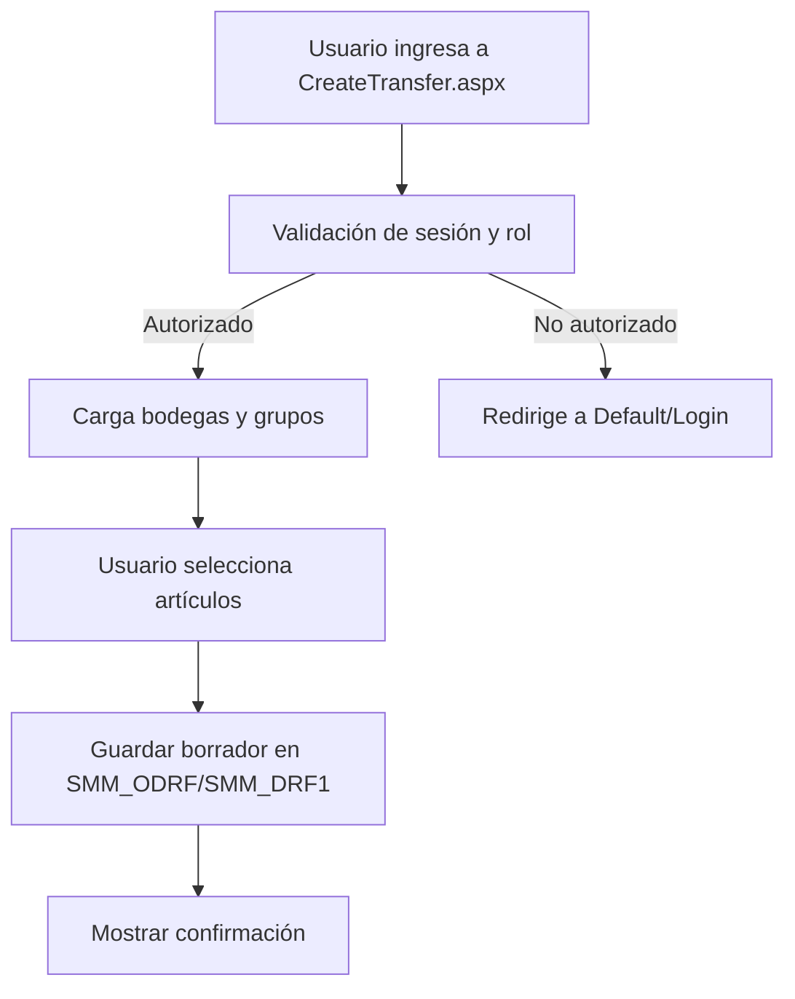
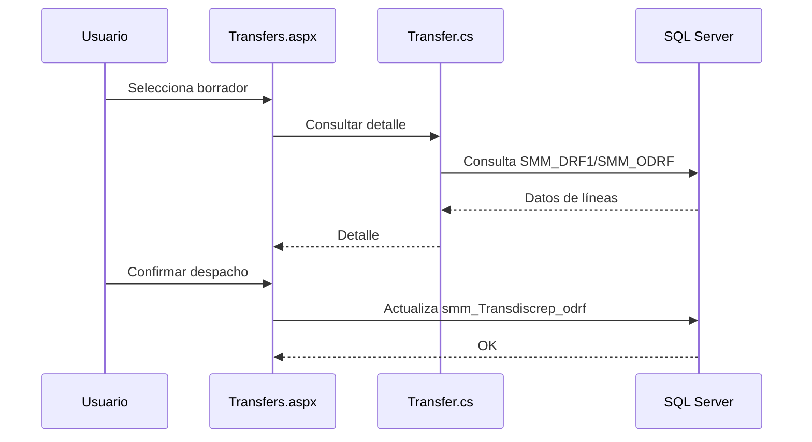
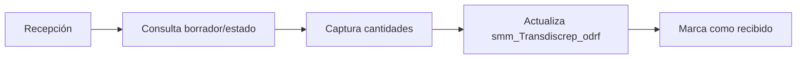
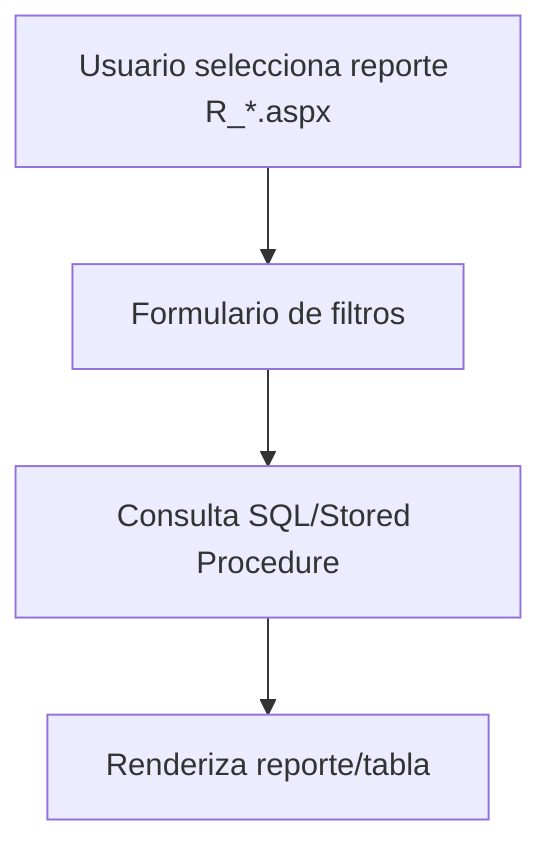
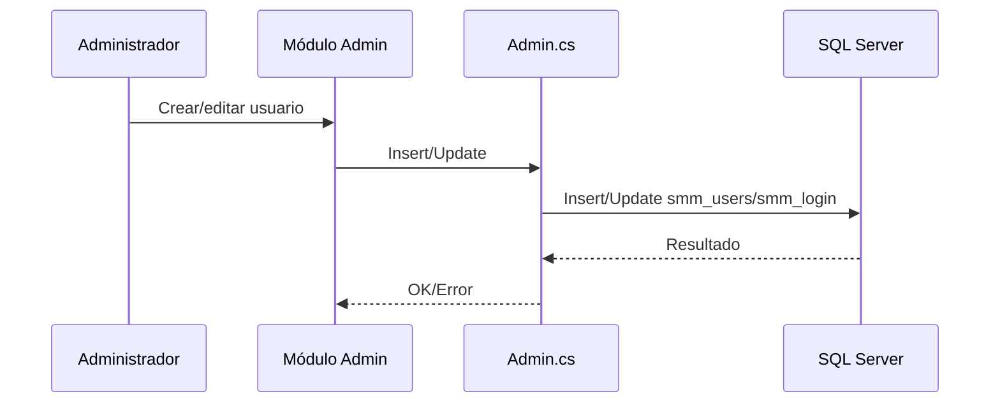

# Casos de uso principales

Este documento describe los casos de uso clave. Para el diagrama general de actores/relaciones, ver **[diagrama-casos-uso.md](diagrama-casos-uso.md)**.

## 1) Crear transferencia de inventario
**Actor principal:** Operador de bodega/tienda

**Descripción:** El usuario crea un borrador de transferencia seleccionando bodega origen/destino y artículos.

**Diagrama (flujo):**

## 2) Despachar transferencia
**Actor principal:** Operador de despacho

**Descripción:** Se despacha un borrador y se marca el estado de despacho en las tablas de discrepancias.

**Diagrama (secuencia):**

## 3) Recibir transferencia
**Actor principal:** Operador de recepción

**Descripción:** Se registran cantidades recibidas y se cierra el proceso.

**Diagrama (flujo):**

## 4) Reportes operativos
**Actor principal:** Analista/Administrador

**Descripción:** Consulta reportes de inventario, bines, min/max y kardex.

**Diagrama (flujo):**

## 5) Administración de usuarios
**Actor principal:** Administrador

**Descripción:** Mantiene usuarios, roles y accesos.

**Diagrama (secuencia):**

