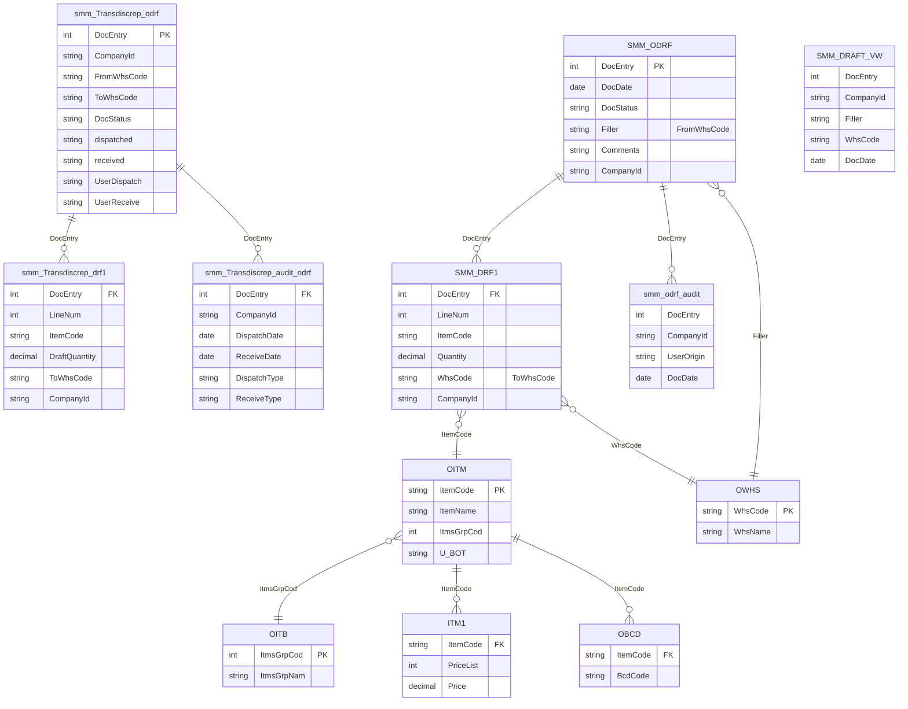

# Diagrama de base de datos (ERD)

> Basado en las consultas de `App_Code/Queries.cs`, `Transfer.cs`, `DataManager.cs` y módulos relacionados.

Referencias adicionales:
- Consultas CTE: `App_Code/Queries.cs`
- Acceso a datos: `App_Code/SqlDb.cs`, `App_Code/DFBUYINGdb.cs`
- Lógica de transferencias: `App_Code/Transfer.cs`
