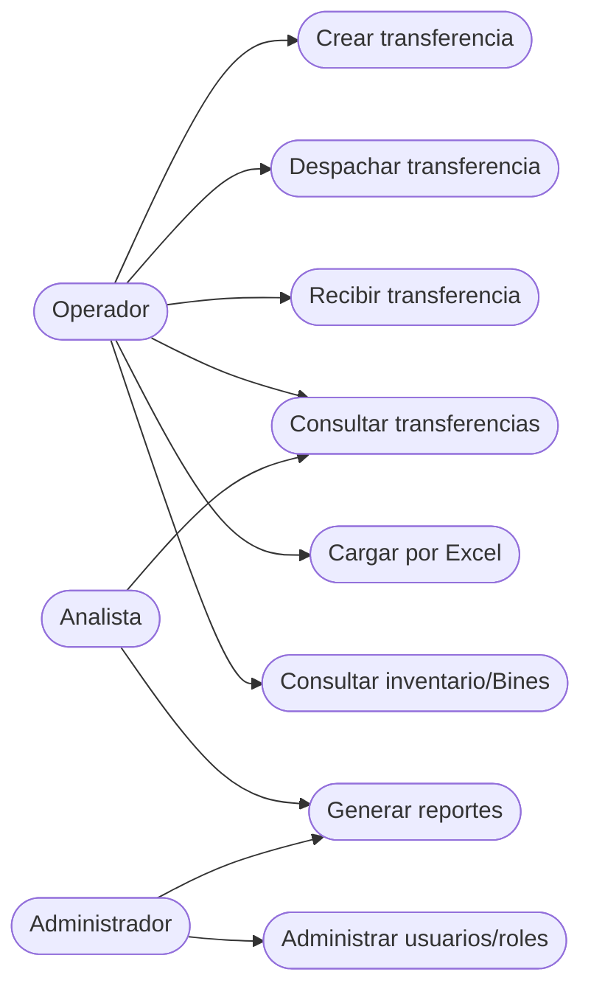

# Diagrama de casos de uso

```mermaid
flowchart LR
    ActorOperador([Operador])
    ActorAdmin([Administrador])
    ActorAnalista([Analista])

    UC1([Crear transferencia])
    UC2([Despachar transferencia])
    UC3([Recibir transferencia])
    UC4([Consultar transferencias])
    UC5([Generar reportes])
    UC6([Administrar usuarios/roles])
    UC7([Cargar por Excel])
    UC8([Consultar inventario/Bines])

    ActorOperador --> UC1
    ActorOperador --> UC2
    ActorOperador --> UC3
    ActorOperador --> UC4
    ActorOperador --> UC7
    ActorOperador --> UC8

    ActorAnalista --> UC4
    ActorAnalista --> UC5

    ActorAdmin --> UC5
    ActorAdmin --> UC6
```

Para el detalle funcional ver **[casos-uso.md](casos-uso.md)**.
