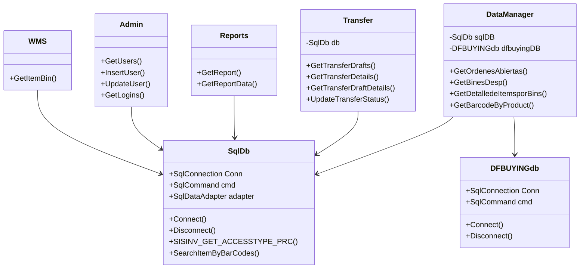

# Diagrama de clases / servicios

Referencias:
- `App_Code/SqlDb.cs`
- `App_Code/DFBUYINGdb.cs`
- `App_Code/DataManager.cs`
- `App_Code/Transfer.cs`
- `App_Code/Reports.cs`
- `App_Code/Admin.cs`
- `App_Code/WMS.cs`
