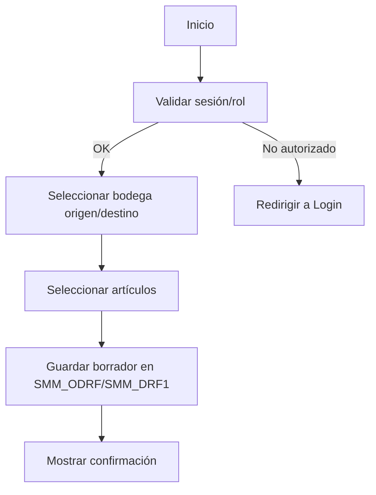
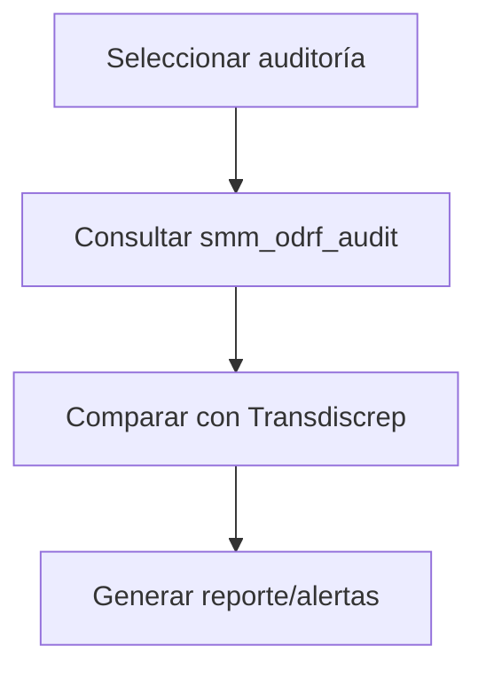

# Diagramas de flujo

## Flujo: creación de transferencia


## Flujo: despacho y recepción
```mermaid
flowchart TD
    A[Consultar borradores] --> B[Ver detalle (TransferDetails.aspx)]
    B --> C[Despachar]
    C --> D[Actualizar smm_Transdiscrep_odrf]
    D --> E[Recepción]
    E --> F[Actualizar recibido y cierre]
```

## Flujo: auditoría


Referencias:
- `Transfers.aspx`, `TransferDetails.aspx`
- `App_Code/Transfer.cs`, `App_Code/Queries.cs`
